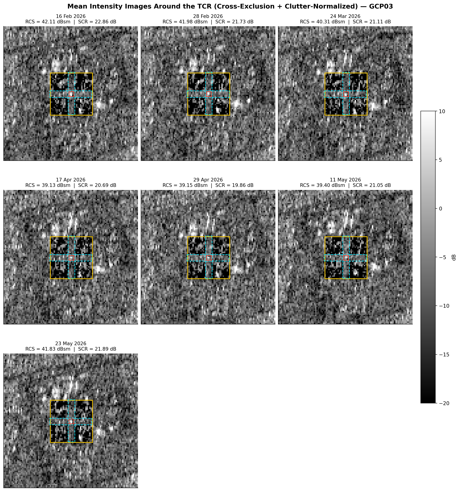

# CoRAL-Sentinel1-TCR

**A modified extension of CoRAL (Corner Reflector Analysis Library)**, originally
developed by Geoscience Australia, adapted for radiometric analysis (RCS/SCR) of
a Trihedral Corner Reflector (TCR) using Sentinel-1 SAR imagery.

> **Note on authorship.** This repository is **not** an original implementation.
> It is a modification and extension of the original CoRAL library
> (Copyright 2018 Geoscience Australia, Apache License 2.0), developed as part
> of an undergraduate/graduate thesis project. All original CoRAL source code,
> theoretical formulation, and licensing terms are retained and attributed to
> the original authors (Garthwaite, 2017; Geoscience Australia). See
> [`LICENSE`](./LICENSE) for the full Apache-2.0 license text.

## Original Reference

This work builds on the corner reflector analysis methodology and formulation
described in:

> Garthwaite, M. C. (2017). *On the Design of Radar Corner Reflectors for
> Deformation Monitoring in Multi-Frequency InSAR*. Remote Sensing, 9(7), 648.
> https://doi.org/10.3390/rs9070648

and the CoRAL software library:

> Geoscience Australia. *CoRAL: Corner Reflector Analysis Library*.
> https://github.com/GeoscienceAustralia/CoRAL

## Summary of Modifications

The original CoRAL library computes the Radar Cross Section (RCS) and
Signal-to-Clutter Ratio (SCR) of a corner reflector by defining the clutter
region as a simple square annulus (a large clutter window minus a smaller,
co-centred target window). This repository introduces the following
modifications, implemented without altering the original CoRAL formulation
(Garthwaite, 2017, Eq. 2, 7, 8) or the original `corner_reflector.py` /
`dataio.py` source files:

### 1. SNAP BEAM-DIMAP (`.dim`) input support

The original CoRAL library only supports GAMMA flat-binary and plain GeoTIFF
inputs. This modification (`coral/dataio.py`) adds a reader for SNAP
BEAM-DIMAP products (`.dim` + `.data` folder) — the standard output format of
ESA SNAP after radiometric calibration and terrain correction — including:

- automatic band resolution for a requested polarisation (e.g. `Sigma0_VV`),
  with fallback handling for both full-swath and single-subswath
  (`split`) Sentinel-1 IW products;
- incidence-angle extraction from either a full-resolution raster band
  (Terrain-Corrected products) or a tie-point grid with bilinear
  interpolation (non-Terrain-Corrected products). **Note:** if SNAP's
  Terrain Correction step is run with its default settings (no
  additional output band selected), the incidence-angle band it
  generates -- and that this code reads -- is the
  **incidenceAngleFromEllipsoid**, not the local incidence angle. If you
  need the local (DEM-based) incidence angle instead, tick that option
  under "Additional Output Parameters" in the Terrain Correction
  operator before running SNAP, and the same raster-band logic here will
  pick it up automatically;
- range/azimuth pixel spacing extraction from BEAM-DIMAP
  Abstracted_Metadata, ensuring the RCS illuminated-area term
  (Garthwaite, 2017, Eq. 2) is computed from the true, scene-specific
  pixel spacing rather than an assumed constant.

### 2. Cross-exclusion clutter window definition

`coral/cross_exclusion.py` (new module) reimplements the clutter-region
definition following the cross-exclusion window described in Garthwaite et
al. (2015, *The Design of Radar Corner Reflectors for the Australian
Geophysical Observing System*, Geoscience Australia Record 2015/03,
Fig. 4.11), in which a plus-shaped ("cross") region spanning the full width
and height of the clutter window is excluded prior to averaging the
remaining four corner quadrants as clutter. This is a stricter definition
than the original CoRAL square-annulus clutter window, intended to exclude
residual mainlobe/sidelobe contamination from the clutter estimate. All
downstream energy, SCR, and RCS formulas (`calc_total_energy`, `calc_scr`,
`calc_rcs`) are reused unmodified from the original `corner_reflector.py`.

### 3. Global clutter median normalisation (optional)

An optional processing variant additionally computes a single global median
of cross-excluded clutter pixels (linear sigma-nought domain), pooled across
all acquisitions in a time series, and subtracts this median from the
cross-excluded clutter pixels of each individual scene prior to RCS/SCR
computation. This is implemented entirely from the notebook via a
`readdimap` monkey-patch, without modifying `coral/dataio.py`. Target-window
pixels are never affected by this step.

**Formula.** Let $C = \{c_1, c_2, \dots, c_N\}$ denote the set of all
cross-excluded clutter pixel values (linear sigma-nought), pooled across
every acquisition date in the time series. The global clutter median is:

$$M_{\text{clutter}} = \text{median}(C)$$

For each scene, every cross-excluded clutter pixel $c_i$ is then normalised
as:

$$c_i' = \max(c_i - M_{\text{clutter}},\ 0)$$

i.e. the pooled median is subtracted from each clutter pixel, floored at
zero to avoid non-physical negative linear-domain values. The normalised
clutter pixels $c_i'$ replace $c_i$ before entering the standard CoRAL
energy/SCR/RCS formulas (Garthwaite, 2017, Eq. 7-8) unchanged. Target-window
pixels are excluded from this operation entirely.

## Target Localisation (Peak Search)

The notebook does not assume the TCR sits at a fixed pixel. Instead, it
locates the TCR automatically for every scene, to account for the
sub-pixel geometric shift introduced by geocoding/terrain correction:

1. The TCR's surveyed static GPS coordinate (UTM easting/northing) is
   converted to geographic longitude/latitude.
2. A small search radius (`SEARCH_RADIUS_M`, default 50 m) is defined
   around that point.
3. Within that search radius, the pixel with the **maximum sigma-nought
   (linear) value** is located -- this is the "peak" pixel.
4. That peak pixel position (not the raw GPS-derived pixel) is used as
   the target centre for the target/clutter window in Section 4.1.1.

This is necessary because the GPS coordinate marks the TCR's true
ground position, but geocoding/terrain-correction errors (and orbital
geometry differences between scenes) can shift the corresponding pixel
location by a few pixels from scene to scene. Searching for the local
sigma0 peak around the known coordinate -- rather than using a single
fixed pixel index for every date -- ensures the target window is always
centred on the TCR's actual impulse response, prior to any RCS
computation.

## Which Notebook Should I Use?

| Notebook | Clutter handling | Recommended for |
|---|---|---|
| `RCS_Corner_Reflector_Analysis_CrossExclusion.ipynb` | Cross-exclusion window only, no normalisation | Homogeneous, low-clutter areas (e.g. open fields, bare soil, rural sites) where background backscatter is spatially uniform and temporally stable |
| `RCS_Corner_Reflector_Analysis_CrossExclusion_ClutterNormalized.ipynb` | Cross-exclusion window + global clutter median normalisation | Heterogeneous, high-clutter/noisy urban environments, where background backscatter varies strongly in space and time due to buildings, roads, and mixed land cover |

In general, use `ClutterNormalized` for urban/built-up sites and the
standard `CrossExclusion` notebook for rural/homogeneous sites.

## Repository Structure

```
CoRAL-Sentinel1-TCR/
|-- coral/
|   |-- corner_reflector.py
|   |-- dataio.py
|   +-- cross_exclusion.py
|-- RCS_Corner_Reflector_Analysis_CrossExclusion.ipynb
|-- RCS_Corner_Reflector_Analysis_CrossExclusion_ClutterNormalized.ipynb
|-- LICENSE
|-- .gitignore
+-- README.md
```

## Quick Start

1. **Install dependencies**: `pip install numpy rasterio matplotlib pandas jupyter`
2. **Input data**: this repository reads SNAP BEAM-DIMAP products (`.dim` +
   `.data` folder). Your Sentinel-1 IW scene must already be processed in
   SNAP through: **Apply Orbit File -> ThermalNoiseRemoval -> Radiometric
   Calibration -> TOPSAR-Deburst -> Range-Doppler Terrain Correction**,
   i.e. an output file named like `..._Orb_tnr_Cal_deb_TC.dim`. Split
   (single-subswath) products ending in `..._Cal_split_deb_TC.dim` are
   also supported.
3. **Open a notebook**, set `DATA_DIR` to your `.dim` folder, adjust
   `TARG_WIN_SZ`, `CLT_WIN_SZ`, `CROSS_WIDTH` if needed (defaults follow
   Garthwaite et al. 2015, Table 4.5 for a 1.5 m C-band TCR), then run
   all cells.

## Example Output

Mean intensity images around the TCR with RCS and SCR annotated per
acquisition date, generated using the cross-exclusion clutter window.

### Urban site example (with global clutter median normalisation)

The example below was processed with
`RCS_Corner_Reflector_Analysis_CrossExclusion_ClutterNormalized.ipynb`,
applied to a TCR deployed in a heterogeneous urban environment at
**Institut Teknologi Sepuluh Nopember (ITS), Surabaya, Indonesia**. Global
clutter median normalisation was used here specifically to compensate for
the elevated and spatially inconsistent background backscatter typical of
a dense urban setting (buildings, roads, mixed land cover).



## License

This project retains the original Apache License 2.0 from Geoscience
Australia's CoRAL library. See [`LICENSE`](./LICENSE).

Copyright 2018 Geoscience Australia. Modifications Copyright 2026
Ferdian Zaki Rahmansyah.
